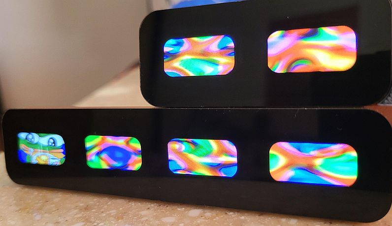

Plasma
======

The Plasma library written in rust. [Api reference](https://royaltm.github.io/rust-plasma/master/rust/plasma/index.html).

How to implement
----------------

`Cargo.toml`:

```toml
[dependencies]
rand = "0.8"

[dependencies.plasma]
git = "https://github.com/royaltm/rust-plasma.git"
```

`main.rs`:

```rust
use plasma::*;
```

Then somwehere in the code:

```rust
    let min_steps = 80.0f32;
    let max_steps = 200.0f32;
    let plasma_width = 200u32;
    let plasma_height = 200u32;
    let mut rng = rand::thread_rng();
    let cfg = PhaseAmpCfg::new(min_steps, max_steps);
    let mut plasma = Plasma::new(plasma_width, plasma_height, cfg, &mut rng);

    loop {
      let buffer_rgb24: &mut [u8] = get_image_buffer_from_somwhere();
      let pitch: usize = get_how_many_bytes_per_line();
      plasma.render::<PixelBufRGB24, PlasmaICP, PlasmaMixer>(buffer_rgb24, pitch, None);
      display_buffer_on_screen();
      plasma.update(&mut rng);
    }
```


Features
--------

* `std` (default) - compile with `std` library.
* `use-simd` - specialized implementation with SIMD instructions. Available only for `x86`, `x86_64` or `aarch64` architectures, requires nightly rustc features. A significant CPU optimization boost can be achieved if compiled with advanced `target-cpu` feature flags. Enables `std`.
* `micromath` - (alternative to `libm`) provides math routines for `no_std`.
* `libm` - (alternative to `micromath`) provides math routines for `no_std`.

SIMD accelerated:

```
RUSTFLAGS='-C target-cpu=+avx2' cargo build --release --features=use-simd
RUSTFLAGS='-C target-cpu=native' cargo build --release --features=use-simd
```


Benchmarking
------------

```
cargo +nightly bench --bench render --features=rand/std -- --nocapture
```

```
RUSTFLAGS='-C target-cpu=native' cargo +nightly bench --bench render --features=rand/std,use-simd -- --nocapture
```


no_std
------

In `no_std` mode `plasma` library still depends on the `alloc` crate and in addition requires one of the two math libraries, which must be enabled by the depending crate:

`Cargo.toml`:

```toml
[dependencies.plasma]
version = "0.2"
git = "https://github.com/royaltm/rust-plasma.git"
default-features = false
features = ["libm"] # or "micromath"
```


#### Plasma on Arm Cortex-M7 with SPI 160x80 displays.


